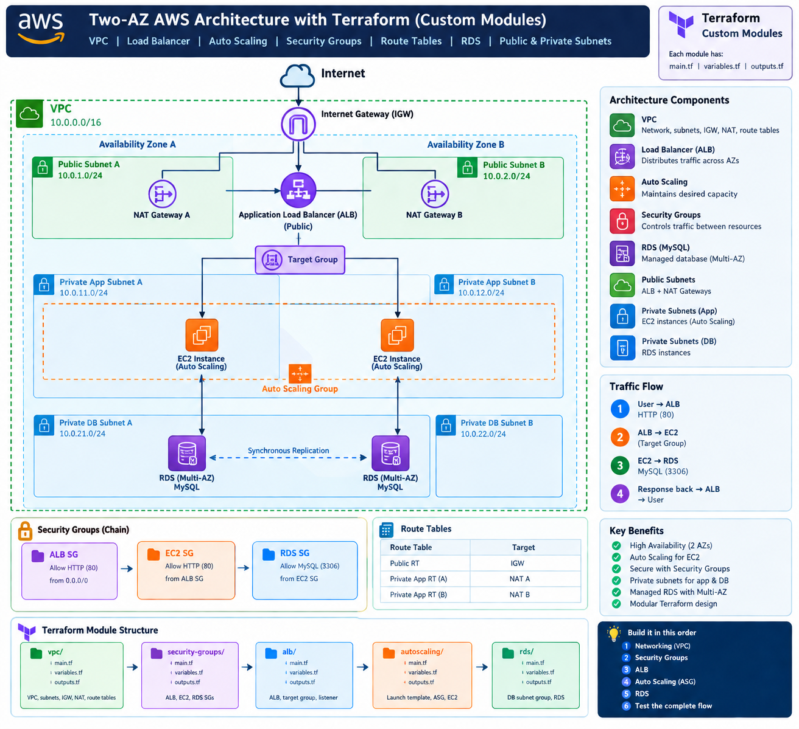

# Two-AZ AWS Architecture with Terraform

This project defines a modular AWS network and application foundation across two Availability Zones. It creates a VPC with public, private application, and private database subnets, then connects the network to security groups, an internet-facing Application Load Balancer, and a private Multi-AZ MySQL database.

The provider is currently configured to use LocalStack endpoints on `localhost:4566`, which makes the project useful for local infrastructure experiments without sending requests to a live AWS account.



> The diagram is a conceptual overview of the target architecture. The Terraform defaults in this repository are authoritative; for example, the code uses `10.0.3.0/24` and `10.0.4.0/24` for private application subnets and `10.0.5.0/24` and `10.0.6.0/24` for database subnets.

## Architecture

The root module composes these custom modules:

```text
Internet
   |
Internet Gateway
   |
Public subnets (us-east-1a, us-east-1b)
   |                         |
 NAT Gateway A           NAT Gateway B
   |                         |
Private app subnet A    Private app subnet B
   |                         |
        Application Load Balancer
                    |
             HTTP target group
                    |
             Application instances

Private database subnet A <--> Private database subnet B
                    |
              RDS MySQL Multi-AZ
```

### Network layout

| Area | Availability Zone | CIDR | Purpose |
| --- | --- | --- | --- |
| VPC | Regional | `10.0.0.0/16` | Main network boundary |
| Public subnet A | `us-east-1a` | `10.0.1.0/24` | Internet-facing resources and NAT gateway A |
| Public subnet B | `us-east-1b` | `10.0.2.0/24` | Internet-facing resources and NAT gateway B |
| Private app subnet A | `us-east-1a` | `10.0.3.0/24` | Application workloads |
| Private app subnet B | `us-east-1b` | `10.0.4.0/24` | Application workloads |
| Private DB subnet A | `us-east-1a` | `10.0.5.0/24` | Database subnet group |
| Private DB subnet B | `us-east-1b` | `10.0.6.0/24` | Database subnet group |

### Traffic flow

1. A client reaches the public ALB over HTTP on port 80.
2. The ALB forwards requests to its HTTP target group.
3. Application instances accept HTTP only from the ALB security group.
4. The database accepts MySQL traffic on port 3306 only from the application security group.
5. Private application subnets use their AZ-specific NAT gateway for outbound internet access.

## Directory structure

Generated Terraform files such as `.terraform/` are intentionally omitted from this source layout.

```text
terraform-aws-two-az-architecture/
├── README.md
├── 1.png
├── main.tf                 # Root module composition and module wiring
├── provider.tf             # Terraform and AWS provider configuration
├── variables.tf            # Root input variables
├── output.tf               # Root outputs (currently empty)
├── .terraform.lock.hcl     # Provider dependency lock file
└── modules/
    ├── vpc/
    │   ├── main.tf         # VPC, subnets, IGW, NAT gateways, routes
    │   ├── variables.tf    # CIDR and project inputs
    │   └── output.tf       # VPC and subnet IDs
    ├── sg/
    │   ├── main.tf         # ALB, application, and database security groups
    │   ├── variables.tf    # Project name and VPC ID
    │   └── output.tf       # Security group IDs
    ├── alb/
    │   ├── main.tf         # ALB, target group, and HTTP listener
    │   ├── variable.tf     # ALB input values
    │   └── output.tf       # Target group ARN and ALB DNS name
    ├── auto_scaling/
    │   ├── main.tf         # AMI lookup, launch template, and ASG
    │   ├── variables.tf    # Instance and subnet inputs
    │   └── output.tf       # Auto Scaling group name
    └── rds/
        ├── main.tf         # DB subnet group and private MySQL RDS
        ├── variables.tf    # Database and subnet inputs
        └── output.tf       # Database endpoint and address
```

## Custom modules

Each module owns one infrastructure responsibility and communicates through typed variables and outputs. This keeps the root module focused on composition and makes individual components easier to reuse or replace.

- **`vpc`** creates the VPC, enables DNS support, creates six subnets across two AZs, attaches the internet gateway, creates one NAT gateway and Elastic IP per AZ, and associates public and private route tables.
- **`sg`** creates the security-group chain. The ALB accepts public HTTP traffic, the application group accepts HTTP only from the ALB group, and the database group accepts MySQL only from the application group.
- **`alb`** creates an internet-facing Application Load Balancer in the public subnets, an HTTP target group, and an HTTP listener.
- **`auto_scaling`** defines an Amazon Linux launch template that installs Apache, plus an Auto Scaling group with one to three instances in private application subnets.
- **`rds`** creates a DB subnet group and a private MySQL 8.0 RDS instance with Multi-AZ enabled, 20 GiB of `gp3` storage, and seven days of backup retention.

The root `main.tf` passes outputs from one module into another. For example, the VPC exports subnet and VPC IDs to the security-group and ALB modules, while the security-group module exports IDs used by the ALB and RDS modules.

## What this architecture solves

- **Single-subnet failure risk:** Workloads and network entry points are spread across two Availability Zones.
- **Uncontrolled internet exposure:** Application and database resources are placed in private subnets instead of receiving public IP addresses.
- **Unrestricted east-west access:** Security groups express the intended ALB -> application -> database trust chain.
- **Private outbound access:** NAT gateways allow private application resources to reach external services without making them directly reachable from the internet.
- **Uneven traffic distribution:** The ALB provides one public entry point and forwards HTTP traffic to registered application targets.
- **Database operational overhead:** RDS provides a managed MySQL service with Multi-AZ deployment and automated backup retention.
- **Infrastructure duplication:** Custom Terraform modules centralize resource patterns and expose small, explicit interfaces.

## Advantages

- **High availability:** Public and private application networking exists in both `us-east-1a` and `us-east-1b`.
- **Network segmentation:** Public, application, and database tiers have separate subnet ranges and route behavior.
- **Fault isolation:** Each private application subnet uses its local NAT gateway, reducing dependence on one AZ.
- **Repeatability:** Terraform can recreate the same infrastructure consistently from code.
- **Clear ownership:** Each module has a focused responsibility, making changes and reviews easier.
- **Local testing path:** LocalStack endpoints allow experimentation without requiring live AWS infrastructure.

## Important implementation notes

The architecture diagram shows the intended complete flow, but the current root module does not instantiate `modules/auto_scaling`. As a result, the ALB target group is created but no application instances are currently attached by the root configuration.

The Auto Scaling module also has two integration issues to resolve before it is enabled:

1. The ASG `target_group_arns` argument currently receives `aws_launch_template.app_template.vpc_security_group_ids[0]`, which is a security-group ID rather than the ALB target-group ARN.
2. The module declares `targate_group_arn` (the name is misspelled), but the value is not used. It should receive `module.alb.target_group_arn` and be used by `target_group_arns`.

Other production considerations include moving the database password out of the default variable value and into a secret manager or sensitive variable input, restricting outbound security-group rules where practical, adding root outputs, and making the AWS region and Availability Zones configurable rather than hard-coded.

## Prerequisites

- Terraform `>= 1.0.0`
- LocalStack running on `http://localhost:4566` for the current provider configuration
- Docker, if LocalStack is run as a container

For deployment to real AWS, replace the LocalStack endpoint configuration and use standard AWS credential resolution such as an AWS profile, environment variables, or an IAM role. Do not keep the example credentials or default database password for production use.

## Usage

Initialize the project:

```bash
terraform init
```

Review the planned changes:

```bash
terraform plan
```

Apply the configuration:

```bash
terraform apply
```

Provide values without editing the source files:

```bash
terraform apply \
  -var='project_name=my-app' \
  -var='database_password=change-this-password'
```

Destroy resources created by the configuration:

```bash
terraform destroy
```

## Inputs

| Variable | Default | Description |
| --- | --- | --- |
| `project_name` | `scaling` | Prefix used in resource names and tags |
| `database_password` | `kashif12345` | Password passed to the RDS instance; sensitive, and should be overridden |

Module-specific inputs and defaults are defined in each module's `variables.tf` file.

## Outputs

The root `output.tf` is currently empty. The modules define useful outputs that can be exposed from the root module later, including the ALB DNS name, RDS endpoint, and Auto Scaling group name.

## Validation

Before applying changes, format and validate the configuration:

```bash
terraform fmt -recursive
terraform validate
```
